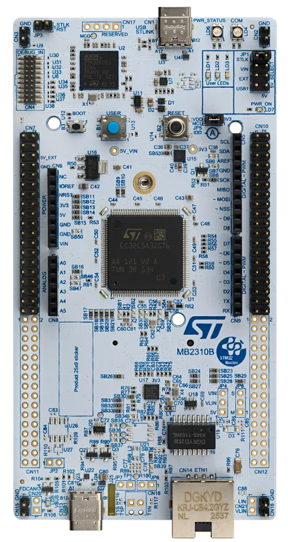
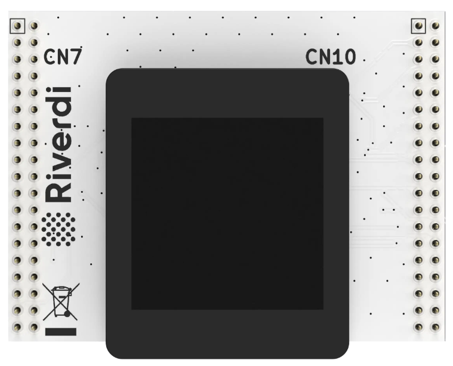
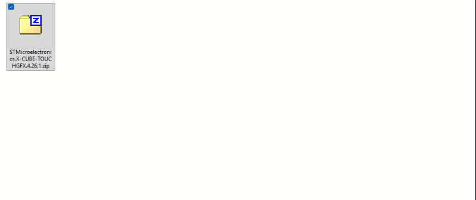
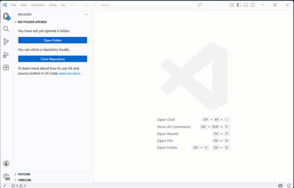
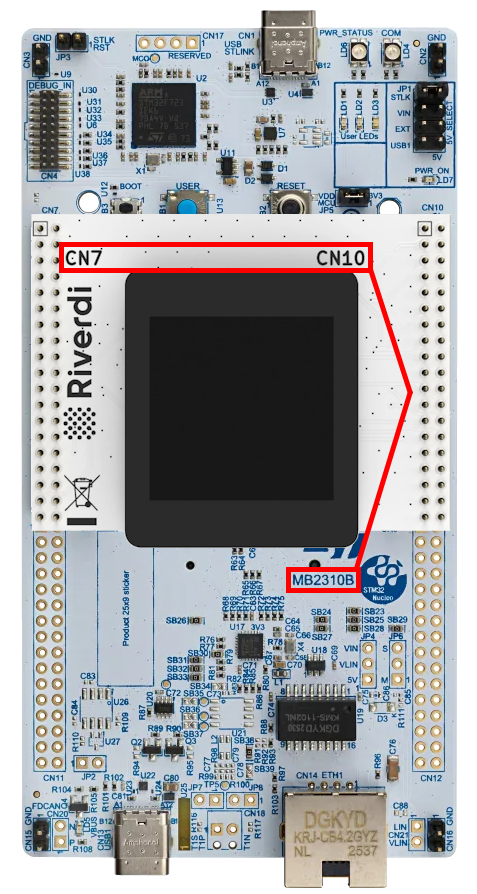
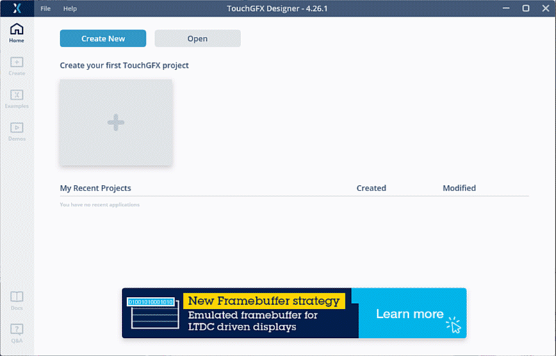
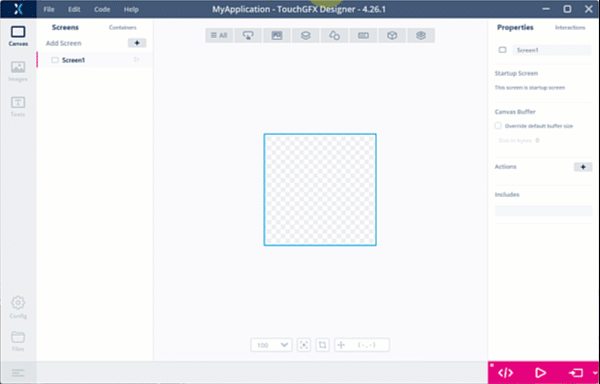
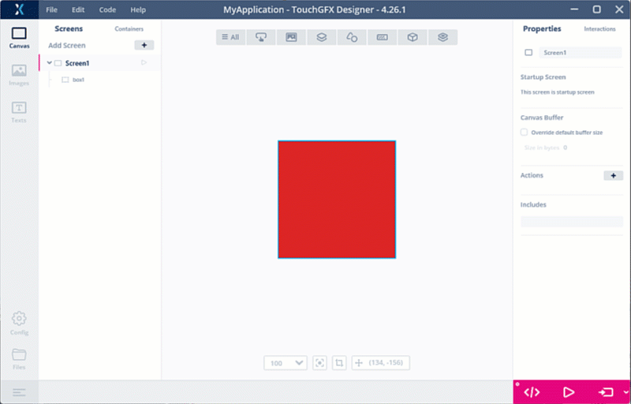
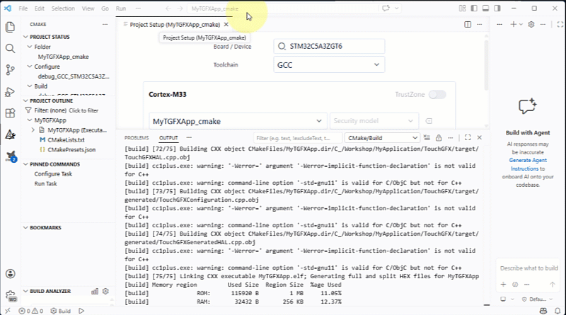

# ST entry level GUIs Demo Workshop <!-- omit from toc -->

## Table of contents <!-- omit from toc -->
- [1.1. Introduction](#11-introduction)
- [1.2. Prerequisites](#12-prerequisites)
  - [1.2.1. Hardware](#121-hardware)
  - [1.2.2. Software](#122-software)
    - [1.2.2.1. TouchGFX Designer](#1221-touchgfx-designer)
    - [1.2.2.2. Microsoft VSCode](#1222-microsoft-vscode)
- [1.3. Sanity Check](#13-sanity-check)
  - [1.3.1 Create a basic TouchGFX project](#131-create-a-basic-touchgfx-project)
  - [1.3.2 Build project in VSCode](#132-build-project-in-vscode)
- [1.4. Hands-on](#14-hands-on)
  - [1.4.1 Introduction](#141-introduction)
  - [1.4.2 Troubleshoot](#142-troubleshoot)
  - [1.4.3 Default VSCode extension Build analyzer](#143-default-vscode-extension-build-analyzer)
  - [1.4.4 TouchGFX Designer RGB Compression feature](#144-touchgfx-designer-rgb-compression-feature)
  - [1.4.4 TouchGFX Designer L8 compression feature](#144-touchgfx-designer-l8-compression-feature)

## 1.1. Introduction
You will find in this repository all the material used during the session and the associated collateral to replicate the activities on your own, during the workshop or afterwards.

## 1.2. Prerequisites

### 1.2.1. Hardware

The hardware setup consists in 2 boards:

  |[NUCLEO-C5A3ZG](https://www.st.com/en/evaluation-tools/nucleo-c5a3zg.html#sample-buy)|[RVA15MD](https://riverdi.com/product/015-nucleo-64)|
  |:---------------:|:--------:|
  |||

### 1.2.2. Software

#### 1.2.2.1. TouchGFX Designer

The current version is the 4.26.1.

The TouchGFX Designer installer cannot be downloaded in a standalone way, it is included in the TouchGFX expansion pack for STM32CubeMX.

- Download [X-CUBE-TOUCHGFX](https://www.st.com/en/embedded-software/x-cube-touchgfx.html)
- Extract the X-CUBE-TOUCHGFX\4.26.1\Utilities\PC_Software\TouchGFXDesigner\TouchGFX-4.26.1.msi
  
- Run the installer and prefer the default installation folder on C:\ drive.

[🔼 Back to top](#table-of-contents)

#### 1.2.2.2. Microsoft VSCode

- Download and install VSCode from [Visual Studio Code Download](https://code.visualstudio.com/download)
- Install the extension "STM32CubeIDE for VSCode"
  - Open VSCode 
  - Create a new "stm32Cube" profile (recommended)
    
  - Open Extensions panel
  - Search for "STM32CubeIDE extension for VSCode", install, dependencies will get installed automatically
    

  [Official user Manuel](https://www.st.com/resource/en/user_manual/um3512-stm32cube-for-visual-studio-code-installation-guide-stmicroelectronics.pdf)

[🔼 Back to top](#table-of-contents)

## 1.3. Sanity Check
Before starting the lab, let's check that your setup is functional.

- Plug the Riverdi display on the NUCLEO-C5A3ZG morpho connector

  

### 1.3.1 Create a basic TouchGFX project
  - Launch TouchGFX Designer and create an empty project using the NUCLEO-C5A3ZG template
    

  - Insert a box widget in the main screen and set color to red
    
  
  - Generate the code
    

[🔼 Back to top](#table-of-contents)

### 1.3.2 Build project in VSCode

  - Open VSCode, be sure to be set the right Profile and open the project folder
    

  - Setup the project (in case you missed the popup window)
    

  - Build the project
    

  - Plug the board and launch a debug session then click on "Go", if the board screen turns to red, sanity check is successfull!
    

[🔼 Back to top](#table-of-contents)

## 1.4. Hands-on

### 1.4.1 Introduction
  This hands-on is focus on external FLASH usage reduction when using bitmaps, it illustrates the following article from the TouchGFX Documentation:
    [Flash-limited GUI Development](https://support.touchgfx.com/docs/flash-limited)

### 1.4.2 Troubleshoot
  TouchGFX Designer installation should complete without issues.

  VSCode installation and especially the STM32CubeIDE extension may be lead to some issues, the most common one concerns [proxy/certificate configuration](https://community.st.com/t5/stm32-mcus/how-to-configure-the-proxy-or-certificate-for-stm32cubeide-for/ta-p/846476).

[🔼 Back to top](#table-of-contents)

### 1.4.3 Default VSCode extension Build analyzer

  The default build analyzer included in the current version of the extension does not give the proper information on external FLASH usage.
  For this hands-on another build analyzer extension 'STM32 Build Analyze" will be used.
  Feel free to use any ohther extension.
  
  
[🔼 Back to top](#table-of-contents)

### 1.4.4 TouchGFX Designer RGB Compression feature

  - Insert an image widget
  - Generate the code
  - Rebuild the Visual Studio project and check the SPI_FLASH usage
    
  - Enable RGB compression in TouchGFX Designer project
  - Generate the code
  - Rebuild the Visual Studio project and check the SPI_FLASH usage

[🔼 Back to top](#table-of-contents)

### 1.4.4 TouchGFX Designer L8 compression feature

  - Import an existing demo to the project
  - Generate the code
  - Rebuild the Visual Studio project and check the SPI_FLASH usage
  - Enable L8_RGB565 compression in TouchGFX Designer project for some images
  - Generate the code
  - Rebuild the Visual Studio project and check the SPI_FLASH usage

[🔼 Back to top](#table-of-contents)

