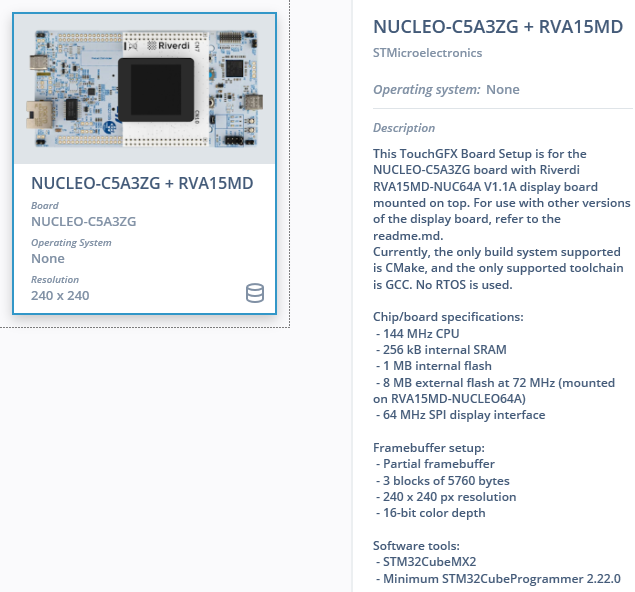
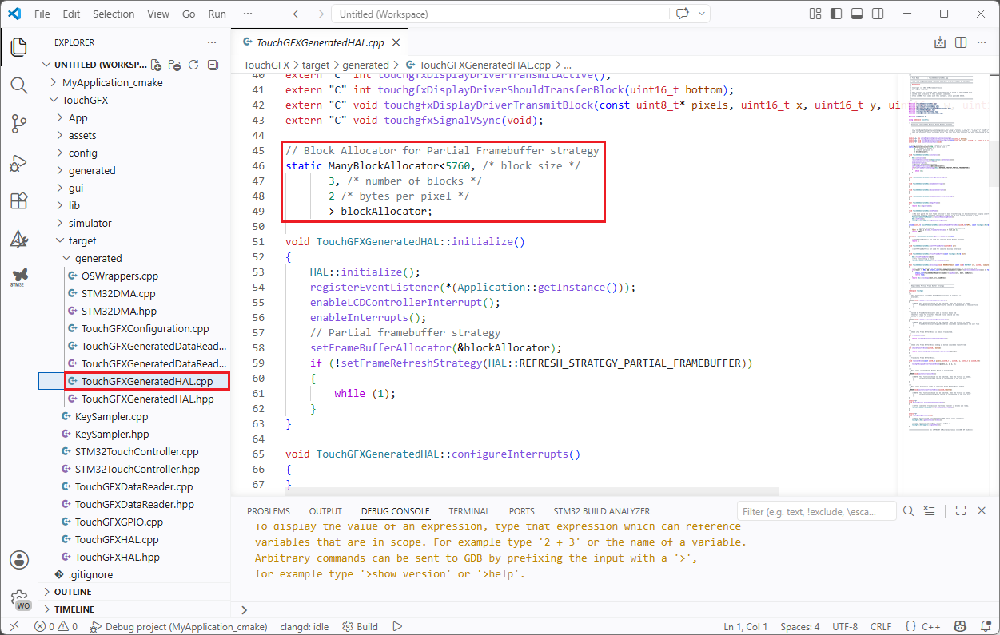
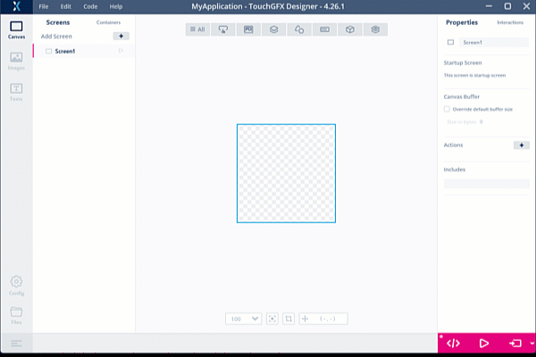
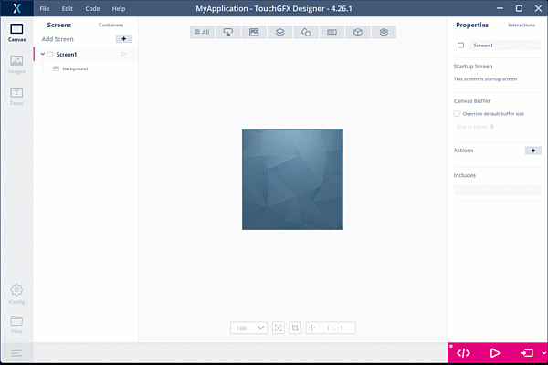
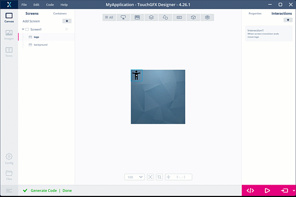
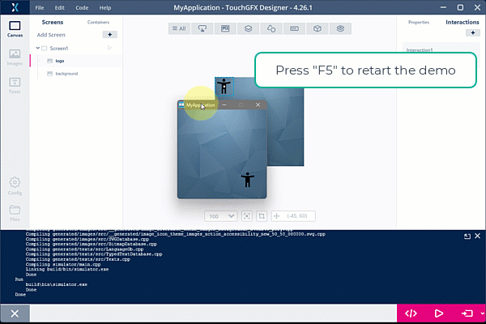
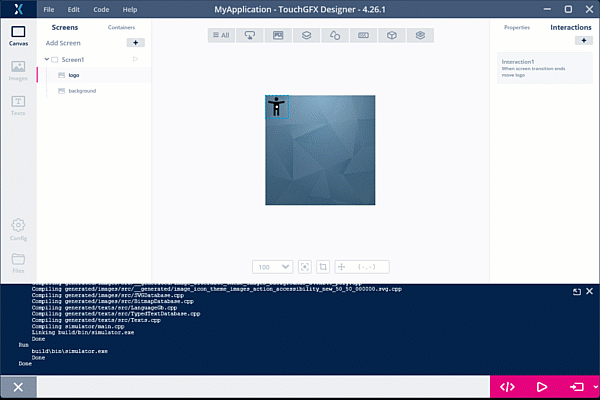
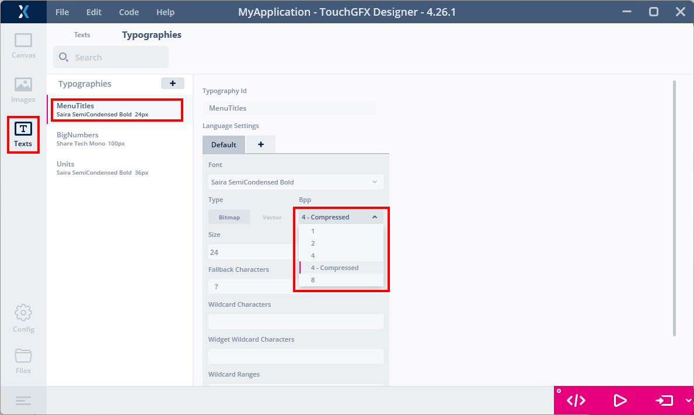
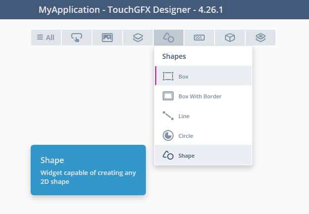

# ST entry level GUIs Demo Workshop <!-- omit from toc -->

This hands-on demonstrates in practice some of the TouchGFX Designer features dedicated to FLASH usage reduction when working on entry-level MCUs.  
[🔼 Home](./README.md#table-of-contents)  

---

## Table of contents <!-- omit from toc -->
- [1. Introduction](#1-introduction)
  - [1.1. Troubleshoot](#11-troubleshoot)
  - [1.2. Build analyzer](#12-build-analyzer)
  - [1.3. NUCLEO-C5A3ZG TBS considerations](#13-nucleo-c5a3zg-tbs-considerations)
  - [1.4. RAM usage reduction](#14-ram-usage-reduction)
- [2. TouchGFX Smart Rendering](#2-touchgfx-smart-rendering)
- [3. TouchGFX Designer RGB image compression feature](#3-touchgfx-designer-rgb-image-compression-feature)
- [4. TouchGFX Designer L8 image compression feature](#4-touchgfx-designer-l8-image-compression-feature)
- [5. Other FLASH saving techniques](#5-other-flash-saving-techniques)
  - [5.1 Compressed LUT format for texts](#51-compressed-lut-format-for-texts)
  - [5.2 Computed graphics](#52-computed-graphics)
  - [5.3 Vector Graphics](#53-vector-graphics)

## 1. Introduction  

  This hands-on is focus on external FLASH usage reduction when using bitmaps, it illustrates the following article from the TouchGFX Documentation:  
  [Flash-limited GUI Development](https://support.touchgfx.com/docs/flash-limited)

### 1.1. Troubleshoot
  [🔼Top](#table-of-contents)  

  VSCode installation and especially the STM32CubeIDE extension may be lead to some issues, the most common one concerns [proxy/certificate configuration](https://community.st.com/t5/stm32-mcus/how-to-configure-the-proxy-or-certificate-for-stm32cubeide-for/ta-p/846476).  

### 1.2. Build analyzer
  [🔼Top](#table-of-contents)  
  
  The default build analyzer included in the current version of the extension does not give the proper information on external FLASH usage.  
  This point is currently being investigated as the time of writing this article.
  For this hands-on a third party extension 'STM32 Build Analyze" will be used, this extension is not recommended by ST, it is just convenient in the current situation.
  Feel free to use any other extension or the VS Code&reg; build output window that provides accurate information on external FLASH usage, but not the details.

### 1.3. NUCLEO-C5A3ZG TBS considerations
  [🔼Top](#table-of-contents)  
  
  A TouchGFX Board Setup (TBS) is read-to-use, complete setup for a specific ST evaluation kit such as a Discovery kit (with embedded display and memory) or a Nucleo kit combined with a display shield (as the one used in this hands-on).  
  
  A TBS contains all the low-level drivers for the selected display as well the Board Initialization Code needed for the display interface (e.g. SPI, FMC, LTDC).  
  The TBSs are based on a STM32CubeMX configuration, so it is possible for you to modify the configuration if you want to experiment or add access to more peripherals.

  The following TBS will be used in this hands-on and has some specificities:  
     

  The STM32C5 family is the first one to come with the updated ecosystem: [STM32CubeMX2](https://community.st.com/t5/developer-news/introducing-stm32cubemx2-a-new-flavor-of-stm32cubemx-tool/ba-p/885793)
  
  If TouchGFX 4.x.x is fully integrated in the STM32CubeMX tool (as an expansion pack) it is not yet the case on STM32CubeMX2 but it is supported.
  The proper integration will be guaranteed by the TouchGFX 5.x.x currently under development.
  
  Additionally, the current version (3.0.3) of the TBS only supports VS Code&reg; IDE (cmake) by default and some minor warnings may be visible in the VS Code&reg; build output windows.
    
  Guidelines on how to use TouchGFX 4.x.x with STM32CubeMX2 projects (starting from scratch) are available on the [TouchGFX Documentation dedicated article](https://support.touchgfx.com/docs/development/scenarios/touchgfx-with-mx2).  
  This article will be regularly updated.  
  
### 1.4. RAM usage reduction
  [🔼Top](#table-of-contents)  
  
  While we focus on the FLASH usage in this hands-on the RAM usage is also at stake on entry-level MCUs.
  On the NUCLEO-C5A3ZG TBS the RAM usage reduction is mainly accomplished by using the [Partial Frame buffer strategy](https://support.touchgfx.com/docs/development/scenarios/lowering-memory-usage-with-partial-framebuffer).  

  The actual configuration is set files that are automatically generated by STM32CubeMX, and is not yet supported by STM32CubeMX2.  
  For this TBS these files have been added manually to make a functional setup and the framebuffer strategy settings can only be tuned directly in the source code.
  If you need to adapt the partial frame buffer strategy settings (size and number of blocks to be used), open the following file and modify it:  
  
  `\TouchGFX\target\generated\TouchGFXGeneratedHAL.cpp`  
  

  
## 2. TouchGFX smart rendering
  [🔼Top](#table-of-contents)  
  
  This section illustrates how the smart rendering algorithm of the TouchGFX library combined with the partial framebuffer strategy allows to minimize the amount of computed and transmitted data to the display.  
  It is independant from the next sections. 

  A background image will be added to the first screen as well as a small icon, both from the stock images.
  An interaction will also be added to move the widget in the screen.
  After generating the code the PC simulator version of the GUI will be launched and a specific feature of the simulator will be enabled.
  This feature allows to identify which part of the framebuffer is updated during the animation.  
 
  1. Insert a background image to the screen  
      
  
  2. Insert a logo image on top of it  
      

  3. Animate the logo using by defining an interaction  
      

  4. Generate and launch the PC simulator version of the GUI  
      
  
  5. Use PC Simulator keyboard shortcuts:  
    `F5` key to restart the demo  
    `F2` key to enable PC simulator feature that shows update region  
      
  
  The interesting point is that, using partial framebuffer strategy, this area is the exact amount of data that is computed and transmitted to the display, using 1 or several buffers depending on the configuration.  

## 3. TouchGFX Designer RGB image compression feature
  [🔼Top](#table-of-contents)  
  
  In this section, we restart from a blank GUI, use the menu `Edit`->`Import`->`GUI`  
  

  First, 2 screens will be defined each one including an image widget populated with a Bitmap from the stock images.
  FLASH usage will be analyzed first without any optimization and then with compression option.
  
  1. Insert a second screen using the dedicated button  
    
  
  2. Insert an image widget in first screen  
    
  
  3. Insert an image widget in second screen  
    
  
  4. Generate the code  
    
  
  5. [Optional] Install a build analyzer, e.g. STM32 Build Analyser  
    
  
  6. Build the VS Code&reg; project and check the SPI_FLASH usage  
    
  
  7. Check the SPI_FLASH usage  
    
  
  8. In the image tab, change the image included in the first screen:  
    - set image format to RGB565  
    - enable compression  
    
  
  9. Still in the image tab, change the image included in the second screen:  
    - image format to ARGB8888 (because selected image has transparency)  
    - enable compression  
    
  
  10. Generate the code from the Designer  
    
  
  11. Rebuild the VS Code&reg; project and check the new SPI_FLASH usage  
    

| Default Configuration | Compression enabled |
|:---------------:|:--------:|
| ||

  With very simple image format settings the external FLASH usage has been significantly reduced (around 28% compression ratio).

## 4. TouchGFX Designer L8 image compression feature 
  [🔼Top](#table-of-contents)  
  
  In this section an existing demo will be imported.
  FLASH usage will be analyzed first without any optimization and after changing the format of some input images to a Look-up table one.

  After demonstrating how to import an existing example or demo to a project we will use the 8-bits Look-Up Table format on some assets of the demo to reduce the footprint of the demo.

  1. Import the existing knob display demo to the project  
      
  
  2. Generate the code  
      
  
  3. Rebuild the VS Code&reg; project and check the SPI_FLASH usage  
      
  
  4. Enable L8_RGB565 compression in TouchGFX Designer project for some images  
    Select several images then apply a parameter to selected images  
      
  
  5. Generate the code  
      
  
  6. Rebuild the VS Code&reg; project and check the SPI_FLASH usage  
      

| Default (RGB565 format) - 1 pixel = 2 bytes color value | Look-Up Table format (L8_RGB565) - 1 pixel = 1 byte LUT index (actual color in LUT) |
|:---------------:|:--------:|
| ||

> Note that the L8 format involves a per-image overhead in internal FLASH to store the Look-Up Table:  
>    
>  
>  The gain in FLASH footprint remains significant despite this, but it must be kept in mind and balanced against the use of RGB compression techniques that has no ROM impact but a computing one at runtime (for the decompression process).  

[More information on LUT color formats](https://support.touchgfx.com/docs/development/ui-development/touchgfx-engine-features/image-compression#l8-compression)

## 5. Other FLASH saving techniques
  
### 5.1 Compressed LUT format for texts
  [🔼Top](#table-of-contents)  

  The Look-up table format compression can also be applied to Fonts, directly in the TouchGFX Designer Texts panel:  
    
  
### 5.2 Computed graphics
  [🔼Top](#table-of-contents)  

  When building a graphical user interface a common practice is to use mostly images for all graphical elements, background images, logo, separators, and then try to reduce their size using compression techniques.  
  However, some graphic elements can be defined using basic geometrical shapes (circle, line, polygons) which are computed at runtime by the Core and hence require no extra FLASH.  
  The TouchGFX Designer offers such basic shapes graphic elements called `Canvas Widgets` and can be found in the `Shape` widget menu:  
  
     
  
  Please refer to the following article for more details:
  [Canvas Widgets](https://support.touchgfx.com/docs/development/ui-development/touchgfx-engine-features/canvas-widgets#custom-canvas-widgets)

### 5.3 Vector Graphics
  [🔼Top](#table-of-contents)  

  Other FLASH usage reduction techniques are available in the TouchGFX Designer, notably the use of Vector Graphics for both images and text.
  However, Vector Graphics processing may have a significant impact on RAM and CPU load and it is usually recommended on MCU with dedicated hardware accelerator (i.e. NeoChrom) or high-end ones, which is out of the scope of this workshop. 

  Please refer to the following article for more details:
  [Flash-limited GUI Development](https://support.touchgfx.com/docs/flash-limited)
  
