# ST entry level GUIs Demo Workshop [🔼 Home](./README.md#table-of-contents) <!-- omit from toc -->

This hands-on demonstrate in practice some of the TouchGFX Designer features dedicated to FLASH usage reduction when working on entry-level MCUs.

---

## Table of contents <!-- omit from toc -->
- [This hands-on demonstrate in practice some of the TouchGFX Designer dedicated to FLASH usage reduction when working on entry-level MCUs.](#this-hands-on-demonstrate-in-practice-some-of-the-touchgfx-designer-dedicated-to-flash-usage-reduction-when-working-on-entry-level-mcus)
- [1. Introduction](#1-introduction)
  - [1.1 Troubleshoot](#11-troubleshoot)
  - [1.2 Default VS Code&reg; extension Build analyzer](#12-default-vscode-extension-build-analyzer)
- [2 TouchGFX Designer RGB Compression feature](#2-touchgfx-designer-rgb-compression-feature)
- [3 TouchGFX Designer L8 compression feature](#3-touchgfx-designer-l8-compression-feature)

## 1. Introduction
  This hands-on is focus on external FLASH usage reduction when using bitmaps, it illustrates the following article from the TouchGFX Documentation:
    [Flash-limited GUI Development](https://support.touchgfx.com/docs/flash-limited)

### 1.1 Troubleshoot
  TouchGFX Designer installation should complete without issues.

  VSCode installation and especially the STM32CubeIDE extension may be lead to some issues, the most common one concerns [proxy/certificate configuration](https://community.st.com/t5/stm32-mcus/how-to-configure-the-proxy-or-certificate-for-stm32cubeide-for/ta-p/846476).  

[🔼Top](#table-of-contents)

### 1.2 Default VS Code&reg; extension Build analyzer

  The default build analyzer included in the current version of the extension does not give the proper information on external FLASH usage.
  For this hands-on another build analyzer extension 'STM32 Build Analyze" will be used.
  Feel free to use any ohther extension.
    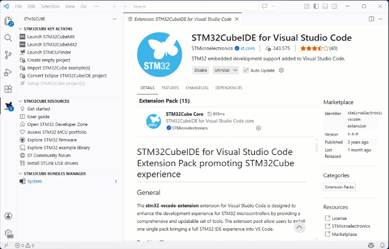  

[🔼Top](#table-of-contents)

## 2. NUCLEO-C5A3ZG TBS consideration
  TouchGFX Board Setup (TBS) are read-to-use complete setup for a specific ST evaluation kits such as Discovery kits with embedded display or Nucleo kit combined with a display shield, as for the TBS used in this hands-on.  
  [TBS for NUCLEO-C5A3ZG + RVA15MD](./img/TBS-NUCLEO-C5A3ZG_RVA15MD.png)
  
  A TBS contains all the low-level drivers for the selected display as well the Board Initialization Code needed for the display interface (e.g. SPI, FMC, LTDC).
  The TBSs are based on a STM32CubeMX configuration, so it is possible for you to modify the configuration if you want to experiment or add access to more peripherals.

  However, the STM32C5 family is the first one to come with the updated ecosystem: [STM32CubeMX2](https://community.st.com/t5/developer-news/introducing-stm32cubemx2-a-new-flavor-of-stm32cubemx-tool/ba-p/885793)
  
  If TouchGFX 4.x.x is fully integrated in the STM32CubeMX tool as an expansion pack it is not yet the case on STM32CubeMX2.
  This integration will be guaranteed by the TouchGFX 5.x.x currently under development.

  The impact on the NUCLEO-C5A3ZG + RVA15MD TBS are:
  - An valid STM32CubeMX2 project (i.e. an .ioc2 file) is provided in the template, containing the proper peripheral configuration based on the Cube ecosystem evolution.
  - The link with TouchGFX is done outside STM32CubeMX2, manually modifying some generated files (e.g. CMakeLists.txt)
  - It is not recommended to generate the code from STM32CubeMX2 as it will break the link with TouchGFX
  - Only VS Code&reg; IDE is currently supported
  - Some minor warnings may be visible in the VS Code&reg; build output windows

  As a summary, this TBS usage must be limited to prototyping on the NUCLEO-C5A3ZG with the Riverdi display and code generation must only be done in the TouchGFX Designer, not from STM32CubeMX2.

  A documentation on how to use TouchGFX 4.x.x with STM32CubeMX2 projects will soon be published.
  
## 3. TouchGFX Designer RGB Compression feature

  In this section 2 screens will be defined each one including an image widget populated with a Bitmap from the stock images.
  FLASH usage will be analyzed first without any optimization and then with compression option.

  Note that for the FLASH usage detailed analysis, a third party package will be used: STM32 Build Analyzer.
  The Build analyzer that comes with the STM32CubeIDE for Visual Studio Code currently does not show the details of the external FLASH usage, only the internal one. However, the build output window will show the relevant information, without details.

  1. Insert a second screen using the dedicated button  
    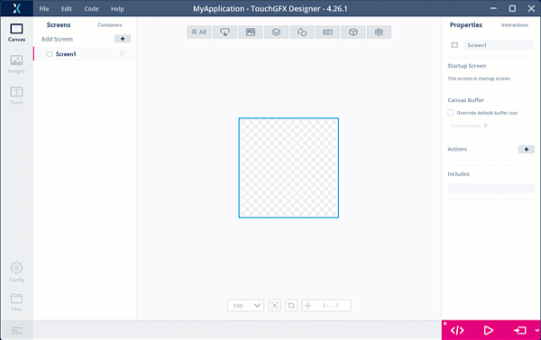
  2. Insert an image widget in first screen  
    
  3. Insert an image widget in second screen  
    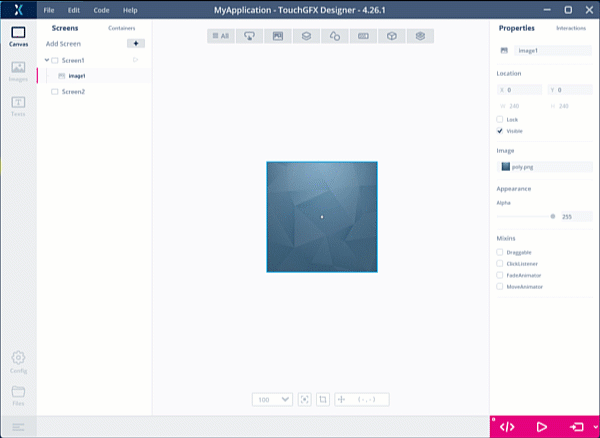
  4. Generate the code  
    
  5. [Optional] Install a build analyzer, e.g. STM32 Build Analyser  
    
  6. Build the VS Code&reg; project and check the SPI_FLASH usage  
    
  7. Check the SPI_FLASH usage  
    
  8. In the image tab, change the image included in the first screen:  
    - set image format to RGB565  
    - enable compression  
    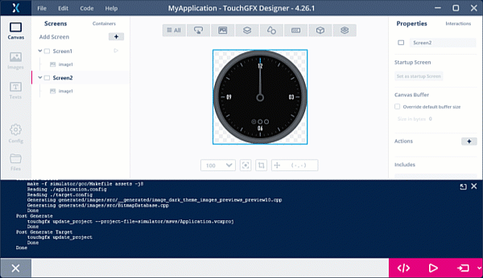
  9. Still in the image tab, change the image included in the second screen:  
    - image format to ARGB8888 (because selected image has transparency)  
    - enable compression  
    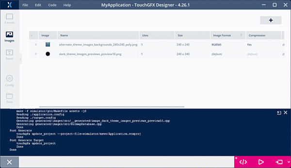
  10. Generate the code from the Designer  
    
  11. Rebuild the VS Code&reg; project and check the new SPI_FLASH usage  
    

| Default Configuration | Compression enabled |
|:---------------:|:--------:|
| 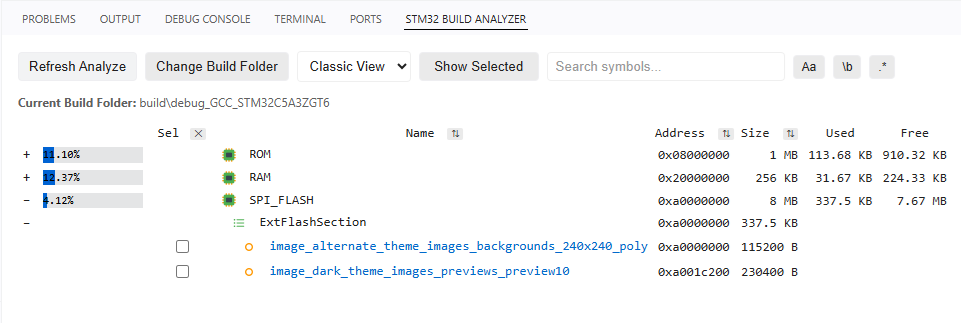|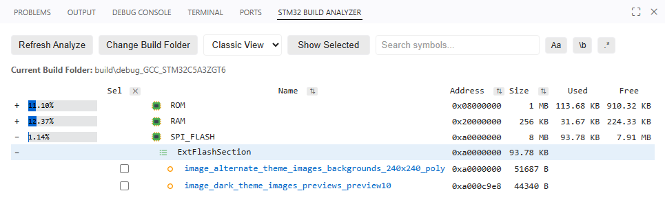|

  With very simple image format settings the external FLASH usage has been significantly reduced (around 28% compression ratio).

[🔼Top](#table-of-contents)

## 4. TouchGFX Designer L8 compression feature

  In this section an existing demo will be imported.
  FLASH usage will be analyzed first without any optimization and after changing the format of some input images to a Look-up table one.

  After demonstrating how to import an existing example or demo to a project we will use the 8-bits Look-Up Table format on some assets of the demo to reduce the footprint of the demo.

  1. Import the existing knob display demo to the project  
    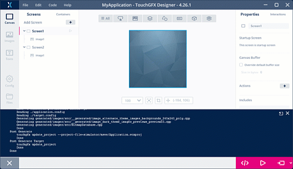  
  2. Generate the code  
    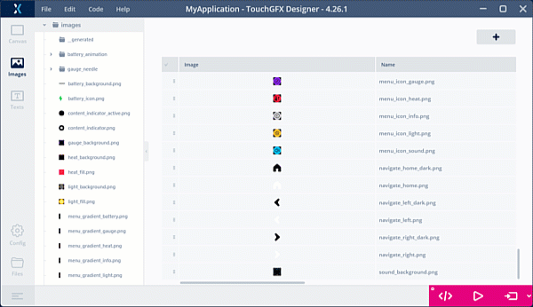  
  3. Rebuild the VS Code&reg; project and check the SPI_FLASH usage  
      
  4. Enable L8_RGB565 compression in TouchGFX Designer project for some images
    4.1. Select several images  
    4.2. Apply a parameter to selected images  
      
  5. Generate the code  
    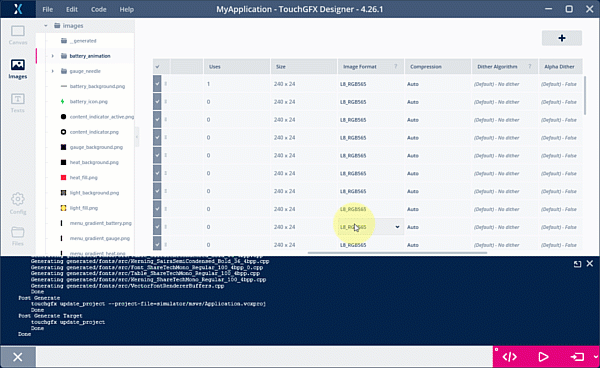  
  6. Rebuild the VS Code&reg; project and check the SPI_FLASH usage  
      

| Default (RGB565 format) - 1 pixel = 2 bytes color value | Look-Up Table format (L8_RGB565) - 1 pixel = 1 byte index + LUT |
|:---------------:|:--------:|
| 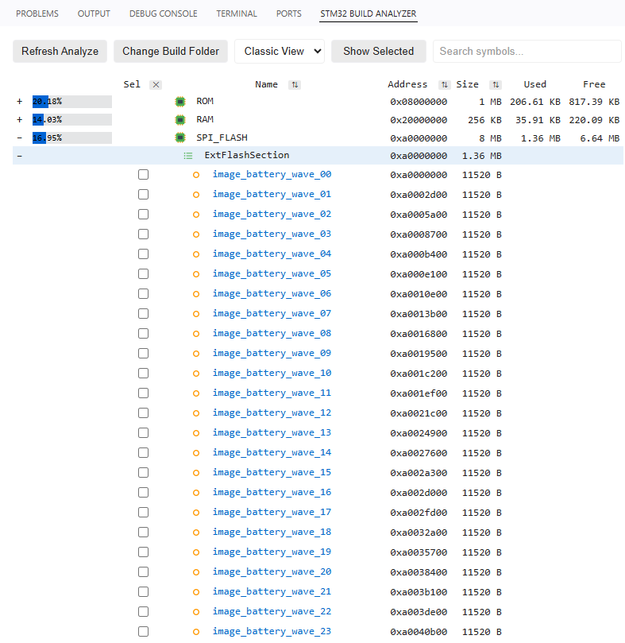|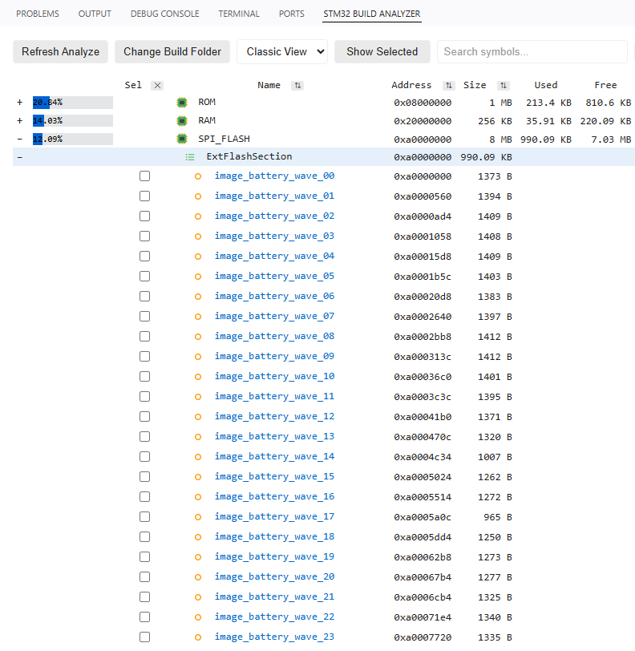|

> Note that the L8 format involves a per-image overhead in internal FLASH to store the Look-Up Table:  
>  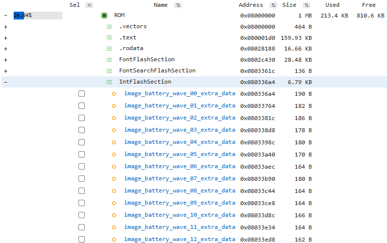  
>  
>  The gain in FLASH footprint remains significant despite this, but it must be kept in mind and balanced against the use of RGB compression techniques that has no ROM impact but a computing one at runtime (for the decompression process).

## 5. Other compression techniques

  Other FLASH usage reduction techniques are available in the TouchGFX Designer, notably the use of Vector Graphics for both images and text.
  However, Vector Graphics processing may have a significant impact on RAM and CPU load and it is usually recommended on MCU with dedicated hardware accelerator (i.e. NeoChrom) or high-end ones, which is out of the scope of this workshop. 

  Please refer to the following article for more details:
  [Flash-limited GUI Development](https://support.touchgfx.com/docs/flash-limited)
  
[🔼Top](#table-of-contents)
